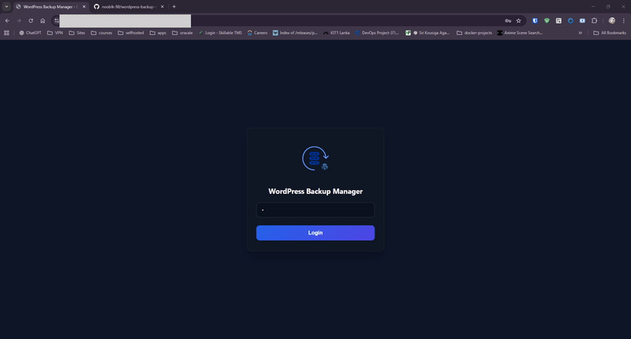

<div align="center">
  

# WordPress Backup Manager

**Single-file PHP backup utility with a modern UI, chunked zipping, and database export for large WordPress sites.**

[](https://www.php.net/)
[](http://www.gnu.org/licenses/agpl-3.0)
[](https://github.com/nooblk-98/wordpress-backup-manager/commits/main)
</div>

---

## What is it?

`backup.php` is a single PHP file you can drop into a WordPress install to back up the database, `wp-content`, or a full site. It includes a clean UI, resumable/chunked zip creation, progress logs, and download links when complete.





## Features

- 🔐 Password protection (MD5 hash) with optional IP allow-list
- ☁️ Cloudflare-aware real-client IP detection
- 🔄 Chunked zipping to avoid timeouts on large sites
- 🗂 Selective `wp-content` backups with ignore lists
- 🗄 Full database export (DROP/CREATE + INSERT), UTF-8 safe
- 🧰 Status logs, progress bars, and async job polling
- 📦 Downloadable zip output for `database`, `wp-content`, or full site
- 🖥 Single PHP file, no Composer or WordPress plugins required

## Quick start

```bash
wget https://raw.githubusercontent.com/nooblk-98/wordpress-backup-manager/refs/heads/main/backup.php

```
## else

1) **Copy the file**  
   Place `backup.php` at the root of your WordPress install (next to `wp-config.php`).

2) **Set a password**  
   Edit the top of `backup.php` and set:
   ```php
   define('BACKUP_PASSWORD_MD5', md5('your-strong-password'));
   ```

3) **(Optional) Limit IPs**  
   Add your IPs or CIDRs:
   ```php
   define('BACKUP_IP_WHITELIST_ENABLED', true);
   define('BACKUP_IP_WHITELIST', ['127.0.0.1', '203.0.113.10', '192.168.0.0/16']);
   ```

4) **Open the tool**  
   Visit `https://your-site.com/backup.php`, log in, and run a backup (database / files / full).

5) **Download**  
   When finished, click “Download Now” from the UI.

## Configuration reference

Key settings at the top of `backup.php`:

| Constant | Purpose |
| --- | --- |
| `BACKUP_PASSWORD_MD5` | MD5 hash of your UI password (required). |
| `BACKUP_IP_WHITELIST_ENABLED` / `BACKUP_IP_WHITELIST` | Optional IP allow-list; supports single IPs and CIDRs. |
| `BACKUP_TRUST_PROXY_HEADERS` | `true` to trust proxy headers (`X-Forwarded-For`, etc.). Leave `false` unless you sanitize headers. |
| `BACKUP_CLOUDFLARE_IP_RANGES` | Cloudflare edge ranges; used to trust `CF-Connecting-IP` when REMOTE_ADDR is Cloudflare. |
| `BACKUP_DIR` / `BACKUP_DIR_FALLBACK` | Primary and fallback backup directories (outside web root preferred). |
| `BACKUP_IGNORE_DIRNAMES` | Default ignore list for `wp-content` backups (e.g., `node_modules`, caches). |
| `DB_DUMP_INSERT_BATCH` / `DB_DUMP_LOG_EVERY_ROWS` | Database export batching and logging frequency. |
| `FILES_LOG_EVERY` / `ZIP_COMPRESS_LEVEL` | File-backup logging cadence and compression level. |

## How it works

- **Database backup**: Exports all tables with DROP/CREATE + INSERT statements, writing a `.sql` file into the backup folder.  
- **Files backup**: Creates a zip of `wp-content` (respects ignore list). Chunked to avoid timeouts.  
- **Full backup**: Runs a DB export, then zips WordPress core + `wp-content` + DB dump.  
- **Async jobs**: The UI polls `/backup.php?action=job_status` or chunk steps to avoid PHP timeouts.  
- **Downloads**: Files are stored in `BACKUP_DIR` (or fallback). The UI provides a direct download link with CSRF protection.

## Security notes

- Always set a strong password (`BACKUP_PASSWORD_MD5`).  
- Use the IP allow-list when exposed to the internet.  
- Leave `BACKUP_TRUST_PROXY_HEADERS` as `false` unless your reverse proxy scrubs headers.  
- Cloudflare: REMOTE_ADDR must be a CF edge IP for `CF-Connecting-IP` to be trusted.

## Operational tips

- **Timeouts/limits**: Chunked zipping reduces timeout risk; adjust `FILES_LOG_EVERY` and `ZIP_COMPRESS_LEVEL` for speed vs. size.  
- **Disk space**: Backups can be large. Point `BACKUP_DIR` to a volume outside web root with sufficient space.  
- **Large DBs**: Tune `DB_DUMP_INSERT_BATCH`; lower values reduce memory use at the cost of larger files.  
- **Clean-up**: Remove old `.zip`/`.sql` files periodically from `BACKUP_DIR` to save space.

## Troubleshooting

- **Blank/500 page**: Check PHP error log; ensure required extensions (`zip`, `mysqli`) are enabled.  
- **Password always fails**: Verify `BACKUP_PASSWORD_MD5` is exactly `md5('your-password')` with no quotes mismatch.  
- **IP denied**: Confirm your real IP and CIDR entries; disable the allow-list temporarily if locked out.  
- **Cloudflare users blocked**: Ensure REMOTE_ADDR is a Cloudflare edge and `CF-Connecting-IP` is present; update CF ranges if needed.  
- **Download not found**: File may have been cleaned up or written to the fallback directory; check `BACKUP_DIR` and `BACKUP_DIR_FALLBACK`.

## Contributing

PRs and issues are welcome. Please keep changes self-contained and maintain the single-file simplicity. For feature requests, open a GitHub issue with clear reproduction steps or desired behavior.

## License

AGPL-3.0. See [LICENSE](LICENSE) for details.
